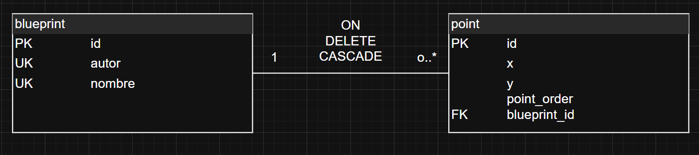
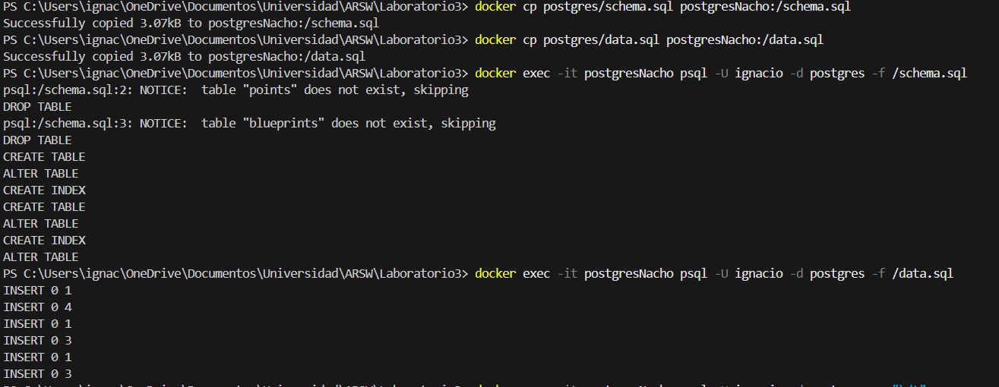
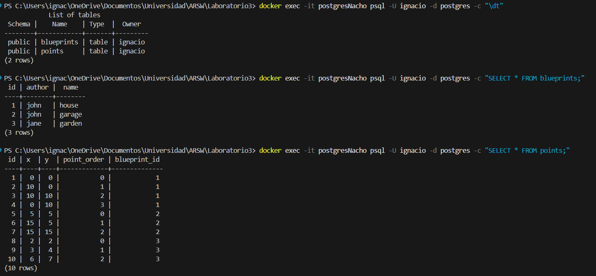
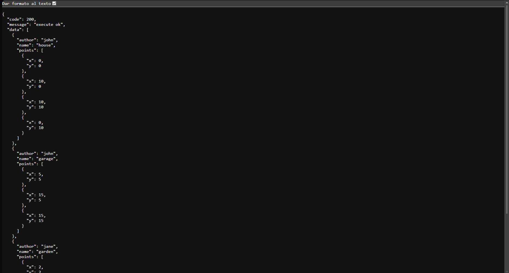
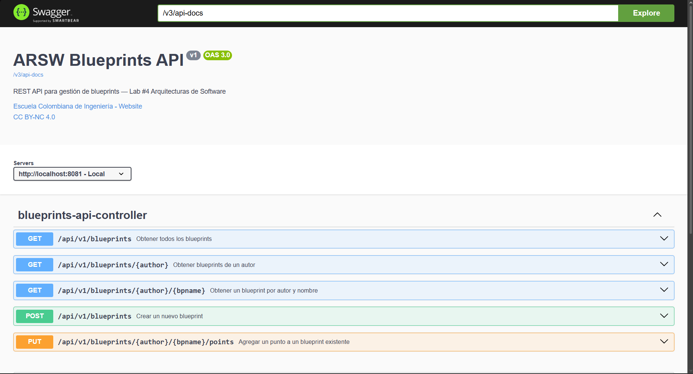
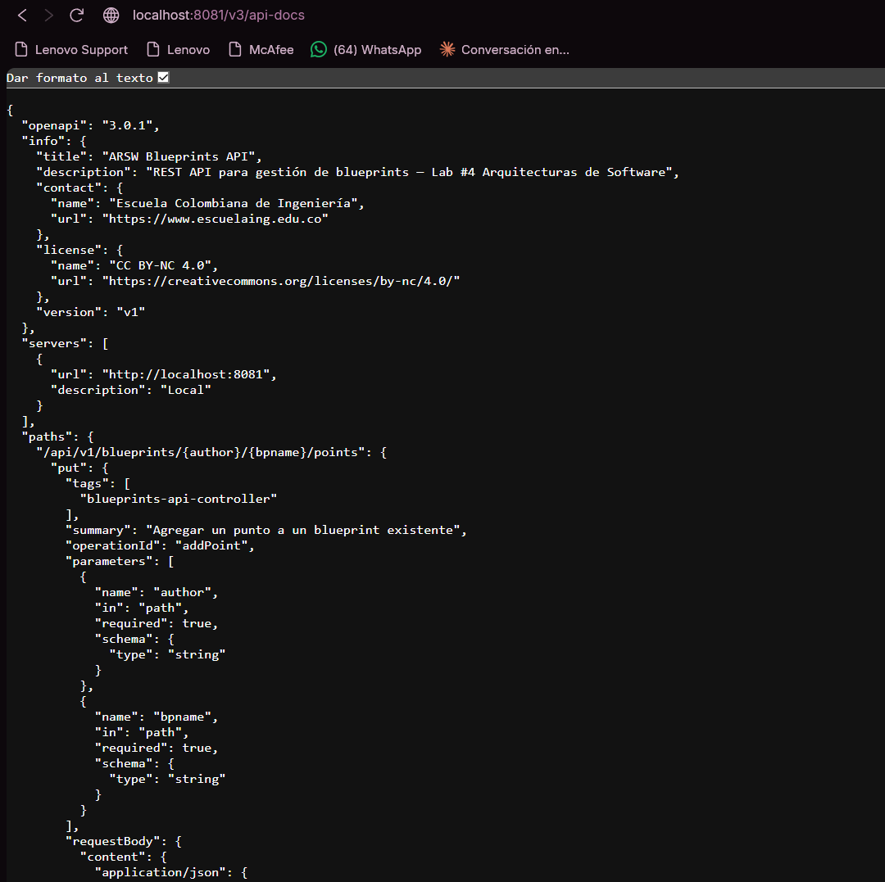
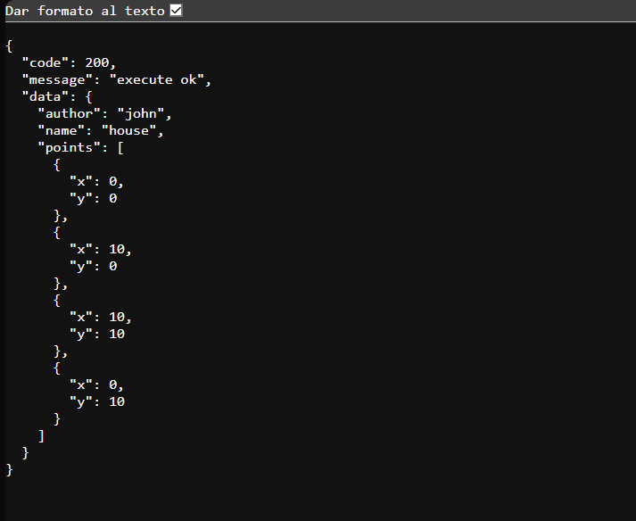
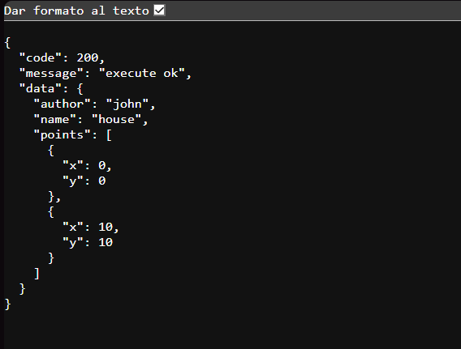

### Solución Laboratorio #3

## Parte 2 - Migración a persistencia en PostgreSQL

Para este punto, iniciamos con la creación de la instancia de Postgres para la migración, utilicé el comando:

docker run -d --name postgresNacho -e POSTGRES_USER=ignacio -e POSTGRES_PASSWORD=venezuela -e POSTGRES_DB=postgres -p 5432:5432 -v postgres-data:/var/lib/postgresql postgres

Para la creación de la BD. Posterior a ello, se crearon las tablas a implementar que eran blueprints y points, se encuentran en: *schema.sql*

Básicamente se crearon las tablas, con sus respectivos conceptos y para mejora de rendimiento se crearon dos índices:
- idx_blueprint_author --> Para búsqueda del autor por su nombre
Se sabe que las UK por defecto también son índices, sin embargo, la UK de la tabla blueprints es compuesta, y el índice solo es del concepto "author"
- idx_point_blueprint --> Para búsqueda de puntos por el id del blueprint

Posterior a ello, se insertaron datos en las tablas para una visualización correcta de su funcionamiento, en: *data.sql*

Se crea PostgresBlueprintPersistence que reemplaza la versión en memoria que estaba en el código, llamado "InMemoryBlueprintPersistence". El cual su función consta:

1. saveBlueprint(Blueprint bp):

Verifica que no exista blueprint duplicado
Inserta el blueprint y captura el ID autogenerado con KeyHolder
Inserta todos los puntos con su point_order correcto

2. getBlueprint(String author, String name):

Busca el blueprint por author+name
Obtiene todos sus puntos ordenados por point_order (crucial)
Reconstruye el objeto Blueprint

3. getBlueprintsByAuthor(String author):

Obtiene todos los blueprints de un autor
Para cada uno, carga sus puntos ordenados
Devuelve un Set de Blueprints completos

4. getAllBlueprints():

Similar al anterior pero sin filtro de autor

5. addPoint(String author, String name, int x, int y):

Obtiene el point_order máximo actual
Inserta el nuevo punto con point_order = max + 1

# Pruebas de funcionamiento

Se utilizaron distintos comandos para comprobar el correcto funcionamiento de la BD creada. Los cuales fueron los que se ven en las imagenes a continuación. De igual manera se comprueba que los datos fueron guardados correctamente en las tablas.

## Parte 3 - Buenas prácticas de API REST

Los cambios realizados, según lo que nos pedía el ejercicio se hacían en BlueprintsAPIController, para lo que pedían "Cambia el path base de los controladores a /api/v1/blueprints."
Y de paso, se creó una clase genérica llamada ApiResponse, en donde se colocaron los códigos HTTP correctos, los cuales fueron los siguientes:

´´
/** 200 OK — consultas exitosas */
    public static <T> ApiResponse<T> ok(T data) {
        return new ApiResponse<>(200, "execute ok", data);
    }

    /** 201 Created — creación exitosa */
    public static <T> ApiResponse<T> created(T data) {
        return new ApiResponse<>(201, "resource created", data);
    }

    /** 202 Accepted — actualización exitosa */
    public static <T> ApiResponse<T> accepted(T data) {
        return new ApiResponse<>(202, "update accepted", data);
    }

    /** 400 Bad Request — datos inválidos */
    public static <T> ApiResponse<T> badRequest(String message) {
        return new ApiResponse<>(400, message, null);
    }

    /** 404 Not Found — recurso inexistente */
    public static <T> ApiResponse<T> notFound(String message) {
        return new ApiResponse<>(404, message, null);
    }

    /** 409 Conflict / 403 Forbidden — recurso ya existe */
    public static <T> ApiResponse<T> conflict(String message) {
        return new ApiResponse<>(409, message, null);
    }
´´

Al ejecutar con mvn spring-boot:run, se ejecuta el proyecto y entramos a http://localhost:8081/api/v1/blueprints, para hacer la confirmación de que si se había aplicado de manera correcta.

## Parte 4 - OpenAPI / Swagger

Ya se había configurado el pom con las dependencias necesarias para que se ejecute el swagger de manera correcta. Se tuvieron que aplicar unos cambios a OpenApiConfig para el correcto funcionamiento, entre ellos: se le añadió Contact, License y Server para que la UI de Swagger muestre información más completa.

Sobre el controlador, ya se tenían los endpoints necesarios y requeridos para este punto del swagger.

Por último, se ejecutó el comando mvn spring-boot:run y se ingresa a la URL http://localhost:8081/swagger-ui.html para poder comprobar que el swagger funciona de manera correcta, y si pudo funcionar como se debía.

Para ver OpenApi JSON, se ingresa al link http://localhost:8081/v3/api-docs y de igual manera, tuvo el funcionamiento esperado.

## Parte 5 - Filtros de Blueprints

Los filtros ya estaban implementados. Lo que sí falta es un problema de configuración: cuando corres sin ningún perfil activo, Spring encuentra dos beans que implementan BlueprintsFilter — IdentityFilter (sin perfil) y cualquiera de los otros — y puede generar conflicto
Y hay un problema en IdentityFilter y es que no tiene @Profile, entonces siempre está disponible. Cuando activas el perfil redundancy, Spring ve dos beans de tipo BlueprintsFilter (IdentityFilter + RedundancyFilter) y no sabe cuál inyectar en BlueprintsServices — falla con NoUniqueBeanDefinitionException.
La solución es ponerle @Profile("default") a IdentityFilter para que solo esté activo cuando no hay ningún perfil especial

Ya con respecto a los filtros:
- **Identity**: Este es sin perfil, no tiene ningún cambio como tal
- **Redundancy**: Elimina puntos consecutivos duplicados. Pero para los datos que tenemos no se evidenciaría este filtro de manera correcta, por lo que no hay duplicados, entonces este filtro se vería igual que Identity.

- **Undersampling**: Conserva 1 de cada 2 puntos. De 4 puntos quedan 2: el índice 0 (0,0) y el índice 2 (10,10). Los índices 1 y 3 se descartan.
Para este filtro si hay una evidencia notoria, porque por ejemplo, con john, solo le quedan dos puntos de los 4 iniciales que tenía.

